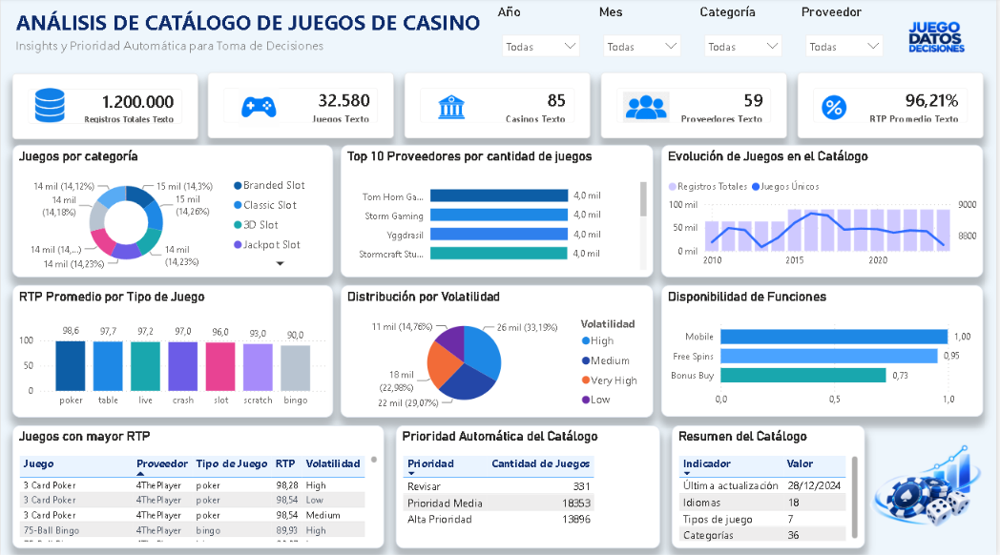

# Casino Analytics

Proyecto de análisis de catálogo de juegos de casino realizado con **SQL y Power BI**.

El objetivo fue trabajar sobre un dataset grande, limpiar y analizar la información, definir indicadores relevantes y construir un dashboard que permita entender mejor el catálogo y apoyar la toma de decisiones.

## Dataset

Fuente: **Kaggle – Online Casino Games Dataset — 1.2M Records**, publicado por **ActarusLab**.

El dataset es sintético pero realista y contiene información sobre juegos de casino, proveedores, RTP, volatilidad, categorías, tipos de juego, compatibilidad mobile, idiomas, jurisdicciones y otras variables relacionadas con el catálogo.

## Proceso

### 1. MySQL / SQL

- Importación del dataset en MySQL.
- Creación de una tabla de trabajo para mantener una copia del dataset original.
- Limpieza y validación de los datos.
- Revisión de tipos de datos y valores nulos.
- Análisis de RTP.
- Análisis de proveedores.
- Análisis por tipo de juego.
- Análisis de volatilidad.
- Desarrollo de consultas para responder preguntas de negocio.
- Creación de una lógica de priorización automática del catálogo.

### 2. Power BI

- Conexión de Power BI con MySQL.
- Transformación y validación de datos con Power Query.
- Creación de medidas y KPIs con DAX.
- Desarrollo de filtros interactivos.
- Creación de visualizaciones para analizar el catálogo.
- Construcción del dashboard final.

## KPIs principales

- **1.200.000 registros**
- **32.580 juegos únicos**
- **85 casinos**
- **59 proveedores**
- **96,21% RTP promedio**

## Análisis incluidos

El dashboard permite analizar:

- Juegos por categoría.
- Top proveedores por cantidad de juegos.
- Evolución del catálogo.
- RTP promedio por tipo de juego.
- Distribución por volatilidad.
- Disponibilidad de funciones como Mobile, Free Spins y Bonus Buy.
- Juegos con mayor RTP.
- Resumen general del catálogo.

## Priorización automática

También se desarrolló una clasificación automática para priorizar juegos dentro del catálogo.

La lógica considera variables como:

- RTP
- Compatibilidad mobile
- Disponibilidad por países
- Multiplicador máximo

A partir de estas variables, los juegos se clasifican en:

- **Alta Prioridad**
- **Prioridad Media**
- **Revisar**

Resultados obtenidos:

- **13.896 juegos – Alta Prioridad**
- **18.353 juegos – Prioridad Media**
- **331 juegos – Revisar**

## Herramientas utilizadas

- MySQL
- SQL
- Power BI
- Power Query
- DAX
- Excel

## Resultado final

El proyecto combina análisis de datos, lógica de negocio y visualización para transformar un dataset de gran volumen en información útil para la toma de decisiones.

El dashboard final permite identificar patrones, comparar indicadores y detectar oportunidades de optimización dentro de un catálogo de juegos de casino.
